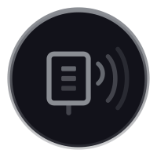

<p align="center">
  
</p>

<h1 align="center">Bench</h1>

<p align="center"><strong>USB hardware discovery for your AI tools.</strong></p>

Bench is a native macOS [MCP server](https://modelcontextprotocol.io) that gives AI tools like Claude Code, Cursor, and Windsurf visibility into connected USB hardware. It identifies devices, finds serial ports, and recognizes common maker boards — so your AI assistant knows what's on your bench.

No API keys. No drivers. One command to install.

## What it does

21 tools across four categories:

### Discovery

| Tool | Description |
|------|-------------|
| `ping` | Health check — returns server status, version, macOS version |
| `list_usb_devices` | List all connected USB devices with vendor, type, speed, serial |
| `get_device_info` | Detailed info on a specific device by serial, location ID, or name |
| `identify_device` | Smart identification of 83+ known maker/dev boards |
| `list_serial_ports` | Enumerate serial ports with USB device matching |
| `hub_topology` | USB hub tree view showing port hierarchy and connections |
| `device_descriptors` | Full USB descriptor chain — interfaces, endpoints, class codes |

### Monitoring

| Tool | Description |
|------|-------------|
| `monitor_events` | Detect USB connect/disconnect events between calls |
| `snapshot_state` | Capture and diff USB device state snapshots |
| `diagnose_device` | Query system logs for USB errors on a specific device |
| `power_info` | Per-device power draw, bus budgets, charging detection |

### Management

| Tool | Description |
|------|-------------|
| `eject_device` | Safely unmount and eject removable storage |
| `tag_device` | Persistent user-defined aliases for devices |
| `port_reset` | Reset a USB port to recover frozen devices |
| `flash_firmware` | Flash firmware via esptool/dfu-util/avrdude/UF2 |
| `hid_send` | Send/receive raw HID reports |

### Serial Communication

| Tool | Description |
|------|-------------|
| `serial_open` | Open a serial connection with configurable baud rate, data bits, parity |
| `serial_read` | Read available data from an open serial connection |
| `serial_write` | Write data or commands to an open serial connection |
| `serial_close` | Close an open serial connection |
| `serial_monitor` | Capture serial output for N seconds (boot logs, debug output) |

## Features

- **Device classification** — automatically categorizes devices as storage, input, hub, video, serial adapter, microcontroller, or debugger
- **Serial port detection** — maps USB devices to their `/dev/cu.*` serial ports (the #1 question makers ask)
- **83+ known boards** — recognizes Arduino, Raspberry Pi, ESP32, Adafruit, SparkFun, Teensy, STM32, and common USB-serial chips
- **Storage info** — mount points, capacity, and free space for USB drives
- **USB monitoring** — event tracking, state snapshots, diagnostic log queries, and power analysis
- **Firmware flashing** — flash ESP32, STM32, Arduino AVR, and RP2040 boards directly
- **HID interaction** — send and receive reports from Stream Decks, macro pads, and custom HID devices
- **Serial communication** — open, read, write, and monitor serial ports with configurable baud rate, data bits, parity, and stop bits

## Requirements

- macOS 14+ (Sonoma or later) on Apple Silicon
- An MCP-compatible AI tool (Claude Code, Cursor, Windsurf, etc.)
- For building from source: Xcode 16.3+ / Swift 6.1+

## Install

### Homebrew (recommended)

```bash
brew install seayniclabs/tap/bench
```

### From source

```bash
git clone https://github.com/seayniclabs/bench.git
cd bench
swift build -c release
codesign --force --sign - --entitlements Sources/Bench/Bench.entitlements .build/release/Bench
```

The binary is at `.build/release/Bench`.

### Add to Claude Code

```bash
claude mcp add bench -- $(which bench)
```

Or add manually to `~/.claude.json`:

```json
{
  "mcpServers": {
    "bench": {
      "command": "/path/to/bench",
      "args": []
    }
  }
}
```

## Usage

Once connected, just talk to your AI tool:

- "What USB devices are connected?"
- "What port is my Arduino on?"
- "Identify the device on /dev/cu.usbserial-2120"
- "Eject the Samsung T7"
- "Show me all storage devices"
- "Open a serial connection to /dev/cu.usbserial-2120 at 9600 baud"
- "Monitor the serial output from my ESP32 for 10 seconds"

## How it works

Bench uses Apple's [IOKit](https://developer.apple.com/documentation/iokit) framework to enumerate USB devices natively on macOS. It enriches results with serial port detection (`/dev/cu.*` scanning), storage info (`diskutil`), and a built-in database of known maker boards. It communicates with AI tools over stdio using the [Model Context Protocol](https://modelcontextprotocol.io) (JSON-RPC).

```
AI Tool  --stdio/JSON-RPC-->  Bench  --IOKit-->  USB Device Tree
                                     --diskutil-->  Storage Info
                                     --/dev/cu.*-->  Serial Ports
                                     --DeviceDB-->  Board Recognition
```

No special permissions needed. IOKit USB enumeration works without entitlements from a CLI binary.

## Building

```bash
swift build             # debug build
swift build -c release  # release build
swift test              # run tests
```

Bench requires Swift 6.1+ and targets macOS 14+.

## License

MIT

## Credits

Built by [Seaynic Labs](https://seayniclabs.com).
